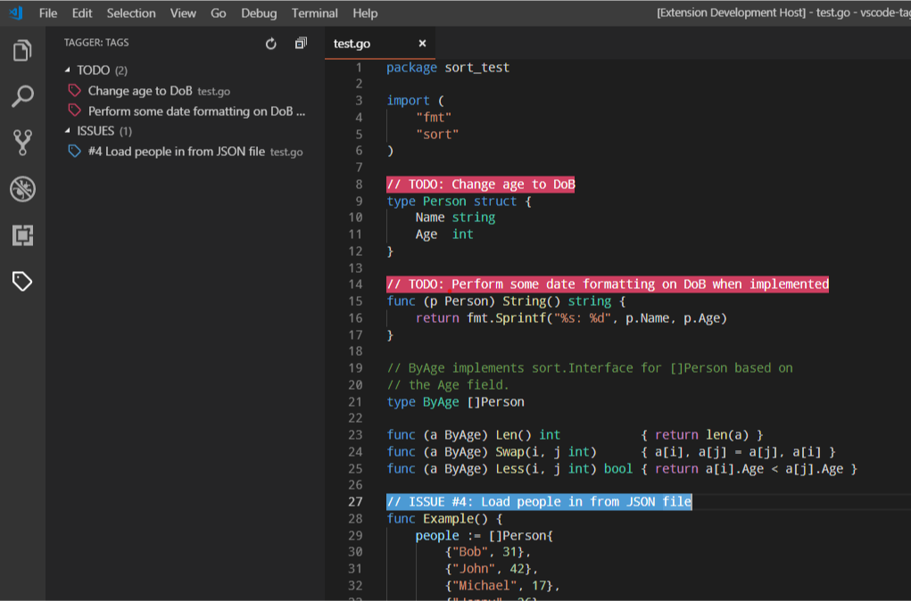

# pd93 / vscode-tagger

An extension for [Visual Studio Code](https://code.visualstudio.com) to browse, highlight and manage in-code tags, todos and notes.



## Links

- [Changelog](./CHANGELOG.md)
- [Roadmap](./ROADMAP.md)
- [License - MIT](./LICENSE)

## Features

- Regex pattern matching (with flags)
- Tag browser
- Tags highlighting
- Commands
  - Go to tag(s)
  - Delete tag(s)

## Settings

### `updateOn: string` - Whether tagger should update tags when a file is changed or when it is saved.

This should be set to either `change` (default), `save` or `manual`. When set to `manual`, you will need to update the tags using the `refresh` command (`F1 > "Tagger: Refresh"`) or by pushing the refresh button. Setting `updateOn` to `change` or `save` will update the tags when a file is changed or saved respectively.

---

### `include: string` - Glob pattern for files to include when searching for tags.

Files that match this pattern will be searched for tags. The default pattern is `**/*` which will match all text files in the workspace.

---

### `exclude: string` - Glob pattern for files to exclude when searching for tags.

Same as `include`, but files that match this pattern will **not** be searched for tags. The default value is `**/node_modules/*` which will stop Tagger from searching node dependencies for tags.

If a file is matched by `include` *and* `exclude`, it will not be searched. 

You do not need to exclude binary files as Tagger does this for you.

---

### `goToBehavior: string` - Set the cursor behaviour when navigating to a tag.

This should be set to either `start`, `end` (default) or `highlight`. When you navigate to a tag and `goToBehaviour` is set to `start` or `end` the cursor will move the start or end of the tag respectively. When set to `highlight` the tag text will be highlighted.

---

### `defaultPattern: Object` - Default tag settings.

This section allows you to specify the default settings for patterns. These settings will be applied to all tags unless overriden (see `patterns` below).

The `flags` field allows you to specify regular expression flags (default is `g`).

- `flags: string`

The  Below, is a list of supported styles:

- `style: Object`
  - `backgroundColor: string`
  - `border: string`
  - `borderColor: string`
  - `borderRadius: string`
  - `borderSpacing: string`
  - `borderStyle: string`
  - `borderWidth: number`
  - `color: string`
  - `fontStyle: string`
  - `fontWeight: string`
  - `opacity: number`
  - `overviewRulerColor: string`
  - `textDecoration: string`

For more details, see the [vscode.DecorationRenderOptions](https://code.visualstudio.com/docs/extensionAPI/vscode-api#DecorationRenderOptions) documenation.

---

### `patterns: Array` - An array of patterns to match tags with.

- `name: string` - Name of the pattern (eg. "todo", "note").
- `pattern: string`
  - Regular expression to match tags
  - Use capture groups to format the display text
  - **Don't forget to double-escape!**
- `flags: string` - Overrides `defaultPattern.flags`.
- `style: Object` - Overrides `defaultPattern.style`.

---

### Example Configuration

In the example configuration below, the `todo` pattern will tag any text with the term `TODO:` followed by a string. Tagger will search in all (non-binary) files in the workspace (except for the `node_modules` folder) and all the found `todo` tags will be highlighted with a red background and white text.

You may define as many patterns as you like, but each pattern **must** contain a name and a pattern string (regular expression). The default style and properties will be applied to all tags unless they are overriden. An example of overriding can be seen in the `issue` pattern below which overrides the default `flags` and `style` properties.

Tagger has support for multi-line highlighting, so you can use new line characters in your patterns (see `multiline` pattern).

You can format the text that is displayed for the tag by using [capture groups](). For example, the `todo` and `issue` patterns both have the capture group: `(.*)`. This will means that only the text in this group will be displayed. The `issue` tag has an additional capture group: `(#\\d+)`. When multiple capture groups are defined, they are concatenated with a single space as a separator. To use brackets without capturing text, you can use the non-capture group syntax `(?:)`.

```json
{
    "tagger": {
        "updateOn": "change",
        "include": "**/*",
        "exclude": "**/node_modules/*",
        "defaultPattern": {
            "style": {
                "color": "#FFF",
                "backgroundColor": "#CF3F61",
                "overviewRulerColor": "#CF3F61"
            }
        },
        "patterns": [
            {   
                "name": "todo",
                "pattern": "TODO: ?(.*)"
            },
            {   
                "name": "issue",
                "pattern": "ISSUE (#\\d+): ?(.*)",
                "flags": "gi",
                "style": {
                    "color": "#FFF",
                    "backgroundColor": "#4C9AD4",
                    "overviewRulerColor": "#4C9AD4"
                }
            },
            {
                "name": "multiline",
                "pattern": "start[^]*end"
            }
        ]
    }
}
```

## Known Issues

- When hot reloading the `settings.json` file, tag decorations stop rendering correctly.
- Error is not produced when a regular expression or its flags are invalid.